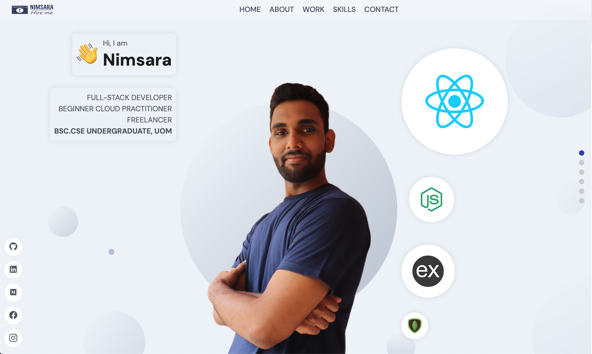
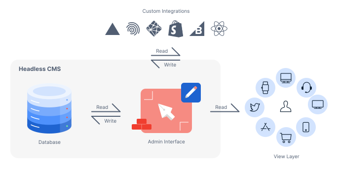
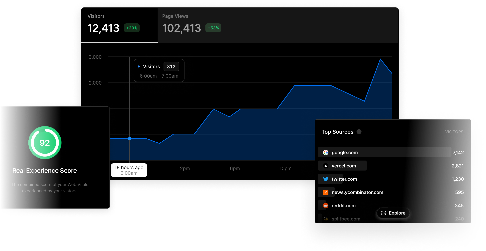

# [My Portfolio Website](https://www.nimsarafernando.com)



<h3 align="center" style="color: #333">Connect with me 🙂</h3>
<p align="center" style="display: flex; align-items: center; justify-content: center;">
<a href="https://linkedin.com/in/nimsara66" target="blank"></a>
&nbsp;&nbsp;&nbsp;&nbsp;&nbsp;
<a href="https://www.facebook.com/mihindukulasuria.fernando" target="blank"></a>
&nbsp;&nbsp;&nbsp;&nbsp;&nbsp;
<a href="https://instagram.com/nimsara_sudeepa" target="blank"></a>
</p>

## Table of Contents

- [My Portfolio Website](#my-portfolio-website)
  - [Table of Contents](#table-of-contents)
  - [Overview](#overview)
  - [Features](#features)
  - [Technologies Used](#technologies-used)
  - [Getting Started](#getting-started)
  - [Configuration](#configuration)
  - [Folder Structure](#folder-structure)
  - [Contributing](#contributing)
  - [Copyrght](#copyrght)

## Overview

As a software engineer, having a portfolio website is crucial for several reasons. This website serves as a centralized hub where I showcase my skills, projects, and achievements. It not only acts as a virtual resume but also provides a dynamic and interactive platform for potential employers, clients, or collaborators to learn more about my work. The portfolio is designed to highlight my technical proficiency, creativity, and problem-solving abilities.

## Features

1. Update content on the portfolio without changing the code using sanity cms admin dashboard.


<h6 align="center" style="color: #333">[Architecture of Sanity CMS](https://www.sanity.io/headless-cms)</h6>

2. Improved SEO with Next.js 14
3. Web analytics, Speed insights and Logs by vercel 


<h6 align="center" style="color: #333">[Vercel Analytics Dashboard](https://vercel.com/analytics)</h6>

## Technologies Used

- [Next.js 14](https://nextjs.org/): Briefly explain why you chose Next.js 14 for your frontend.
- [Sass](https://sass-lang.com/): Explain how you used Sass for styling.
- [Sanity CMS](https://www.sanity.io/): Justify why you chose Sanity CMS for your content management needs.

## Getting Started

1. Clone the repository:

```bash
git clone https://github.com/nimsara66/portfolio.git
```

2. Go into either frontend_next or frontend_react:

```bash
cd frontend_next
```

or

```bash
cd frontend_react
```

3. Install dependencies:

```bash
npm install
```

4. Run the development server:

```bash
npm run dev
```

## Configuration

Add a .env file and fill your credentials

```bash
NEXT_APP_SANITY_PROJECT_ID=<project-id>
NEXT_APP_SANITY_PROJECT_TOKEN=<project-token>
```

## Folder Structure

- ./backend_sanity
  - The sanity cms schema generation for the [portfolio website](https://www.nimsarafernando.com)

- ./frontend_next
  - Latest update on the frontend for the [portfolio website](https://www.nimsarafernando.com)

- ./frontend_react
  - Legacy version of the frontend for the [portfolio website](https://www.nimsarafernando.com)

## Contributing

Feel free to contribute to this project! Your contributions and comments are welcome and appreciated.

1. Fork the repository
2. Create a new branch
3. Make your changes
4. Submit a pull request

## Copyrght

@2024 NIMSARA ALL RIGHTS RESERVED
